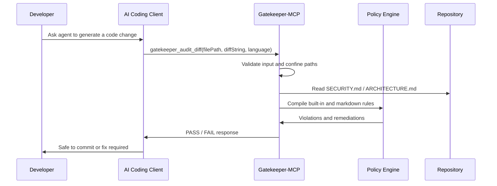

# Gatekeeper-MCP

[](https://github.com/ParthibanRajasekaran/gatekeeper-mcp/actions/workflows/ci.yml)
[](https://github.com/ParthibanRajasekaran/gatekeeper-mcp/actions/workflows/codeql.yml)
[](https://github.com/ParthibanRajasekaran/gatekeeper-mcp/actions/workflows/security-audit.yml)

Gatekeeper-MCP is a zero-trust policy enforcement layer for AI coding agents.

It sits between MCP-compatible AI clients and repository changes, auditing generated diffs against security, architecture, tenancy, and compliance rules before code is committed. It can now be used in two ways:

- as an MCP stdio server for AI coding clients;
- as a CLI audit tool for local terminals and CI workflows.

```text
[Gatekeeper] Compliance check failed.

Audit Results: FAIL
Violations: 1

Rule ARCH-001: No direct fetch
File: src/api/users.ts
Line: 1
Severity: error
Issue: Direct global fetch calls bypass approved HTTP client policies such as auth headers, tracing, retries, and error handling.
Suggested remediation:
import { httpClient } from "@/lib/httpClient";

const response = await httpClient.get("/api/resource");
```

## Why this exists

AI coding assistants can generate changes quickly, but they often do not know an organisation's security, tenancy, observability, or architecture rules. Traditional CI checks catch issues after code is already written. Gatekeeper-MCP shifts those checks earlier by auditing generated diffs before commit.

The project explores a practical AI governance pattern for engineering teams adopting Claude Code, Cursor, GitHub Copilot, and other agentic development tools:

```text
Local policies + MCP tool interception + deterministic diff analysis = shift-left AI guardrails
```

## What makes this different

- **MCP-native**: designed for Model Context Protocol clients rather than a generic CLI-only workflow.
- **CLI-enabled**: usable from terminals, scripts, and future GitHub PR checks.
- **Policy-as-code from existing docs**: turns `SECURITY.md` and `ARCHITECTURE.md` into executable guardrails.
- **Zero-trust input handling**: treats tool arguments, file paths, and diffs as untrusted data.
- **Diff-first enforcement**: analyses generated changes before they land in the repository.
- **MCP-safe stdio posture**: diagnostics go to `stderr` so JSON-RPC transport remains clean.
- **Enterprise roadmap**: planned SARIF, OPA/Rego, AWS Cedar, AST-backed rules, OpenTelemetry, and GitHub PR checks.

## Request lifecycle



## Architecture


## 60 second quickstart

```bash
npm install
npm run typecheck
npm test
npm run build
npm run smoke
```

CLI audit example:

```bash
node dist/cli.js audit --diff demo/failing-diff.patch --file src/api/users.ts --language typescript
```

Expected result:

```text
Audit Results: FAIL
Rule ARCH-001: No direct fetch
```

Passing example:

```bash
node dist/cli.js audit --diff demo/passing-diff.patch --file src/api/users.ts --language typescript
```

Expected result:

```text
Audit Results: PASS
```

Future package target:

```bash
npx -y gatekeeper-mcp audit --diff demo/failing-diff.patch --file src/api/users.ts --language typescript
```

## Claude Desktop configuration

Use the MCP server binary rather than the CLI binary:

```json
{
  "mcpServers": {
    "gatekeeper-mcp": {
      "command": "node",
      "args": ["/absolute/path/to/gatekeeper-mcp/dist/index.js"],
      "env": {
        "GATEKEEPER_WORKSPACE": "/absolute/path/to/your/repo"
      }
    }
  }
}
```

## MCP tool

Gatekeeper exposes one MCP tool:

```text
gatekeeper_audit_diff
```

Input:

```json
{
  "filePath": "src/api/users.ts",
  "language": "typescript",
  "diffString": "@@ -1,1 +1,2 @@\n+const response = await fetch(\"/api/users\");"
}
```

Output:

```text
[Gatekeeper] Compliance check failed.

Audit Results: FAIL
Violations: 1

Rule ARCH-001: No direct fetch
File: src/api/users.ts
Line: 1
Severity: error
Issue: Direct global fetch calls bypass approved HTTP client policies such as auth headers, tracing, retries, and error handling.
Offending code:
+const response = await fetch("/api/users");
Suggested remediation:
import { httpClient } from "@/lib/httpClient";

const response = await httpClient.get("/api/resource");
```

## Built-in guardrails

Gatekeeper-MCP ships with three starter rules:

| Rule | Purpose |
| --- | --- |
| `ARCH-001` | Blocks direct global `fetch()` in TypeScript and JavaScript |
| `SEC-001` | Blocks likely hardcoded secrets |
| `DATA-001` | Blocks raw `SELECT * FROM users` queries without tenant filtering |

## Markdown policy rules

Add structured rules to `.github/SECURITY.md` or `.github/ARCHITECTURE.md`:

````md
## Rule ARCH-001: No direct fetch

Severity: error
Languages: typescript,javascript
Pattern: \bfetch\s*\(

Description:
Direct global fetch calls bypass approved HTTP client policies.

Remediation:
Use the approved HTTP client.

```ts
import { httpClient } from "@/lib/httpClient";

const response = await httpClient.get("/api/resource");
```
````

Free-form markdown is ignored safely. Structured markdown overrides built-in rules by matching rule ID.

## Security posture

Gatekeeper-MCP v1 is intentionally conservative:

- It analyses diffs, not full repositories.
- It inspects only added lines.
- It never executes user code.
- It resolves policy files inside a workspace root.
- It blocks target file paths outside the configured workspace.
- It logs diagnostics to stderr instead of stdout.
- It fails open with built-in rules if local policies cannot be parsed.

For the threat model, see [`SECURITY.md`](./SECURITY.md).

## Demo

Run the local workflow and inspect the sample patches in [`demo/`](./demo):

```bash
npm install
npm run typecheck
npm test
npm run build
npm run smoke
npm run smoke:cli
npx @modelcontextprotocol/inspector node dist/index.js
```

Use the failing diff in [`demo/failing-diff.patch`](./demo/failing-diff.patch) to validate the `ARCH-001` guardrail.

## Local development

```bash
npm install
npm run typecheck
npm test
npm run build
```

## Roadmap

- GitHub Action for pull request checks
- SARIF output for GitHub Code Scanning
- Benchmark suite for policy evaluation latency
- TypeScript AST-backed architecture rules
- OPA/Rego adapter for enterprise policy interoperability
- AWS Cedar adapter for authorization-style guardrails
- OpenTelemetry spans for prompt-to-policy audit trails
- Demo GIF and project website
- npm package release

## Positioning

Gatekeeper-MCP is an open-source AI governance experiment for enterprise engineering teams adopting AI coding assistants. It explores a shift-left model where security and architecture policy can guide generated code before it is committed.
