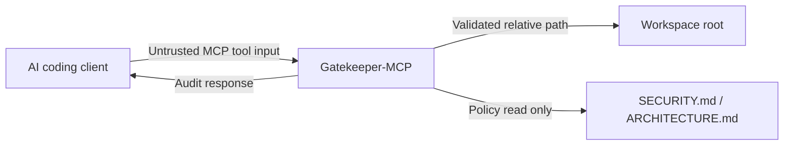

# Security Policy and Threat Model

Gatekeeper-MCP is designed as a local policy enforcement layer for MCP-compatible AI coding agents. Its primary goal is to reduce the risk of unsafe AI-generated code reaching a repository without organisation-specific security and architecture checks.

## Supported security posture

Gatekeeper-MCP currently protects the pre-commit and pre-review phase of AI-assisted software development.

It focuses on:

- Auditing generated diffs before commit.
- Preventing hardcoded secrets from being introduced.
- Detecting architectural bypasses such as direct global HTTP calls.
- Detecting tenant-isolation risks in raw user queries.
- Confining file path inputs to a configured workspace root.
- Keeping MCP stdio transport clean by sending diagnostics to stderr.

## Trust boundaries

All incoming MCP tool arguments are treated as untrusted:

- `filePath`
- `diffString`
- `language`
- local markdown policy contents

Gatekeeper-MCP does not execute analysed code.

## STRIDE threat model

| Threat | MCP-specific risk | Current mitigation |
| --- | --- | --- |
| Spoofing | A client submits a misleading file path or language value | Zod validation and language allow-listing |
| Tampering | A malicious path attempts to escape the workspace via traversal | `sanitizeWorkspacePath` confines paths to the workspace root |
| Repudiation | AI-generated changes lack an audit trail | Audit responses include rule IDs, line numbers, and remediation guidance |
| Information disclosure | Policy parsing accidentally reads files outside the repository | Policy discovery searches fixed paths only and resolves within the workspace |
| Denial of service | Very large diffs or pathological rule patterns slow the process | Input size limits and maximum pattern length checks are applied |
| Elevation of privilege | AI-generated code bypasses approved architecture or tenancy boundaries | Built-in guardrails detect selected high-risk patterns before commit |

## What Gatekeeper-MCP protects against

- Introduction of likely hardcoded secrets.
- Direct use of `fetch()` where an approved HTTP client is required.
- Raw user queries that omit tenant filtering.
- Workspace path traversal attempts in MCP tool inputs.
- Accidental stdout logging that could corrupt JSON-RPC stdio transport.
- Unsafe local policy parse failures causing full server crashes.

## Out of scope for v1

- Runtime sandboxing of generated code.
- Full repository scanning.
- Guaranteed semantic detection of prompt injection.
- Full ReDoS-proof regex execution.
- Authoritative secrets detection equivalent to dedicated scanners.
- Replacement for CI, SAST, DAST, or human code review.

## Planned security upgrades

- OPA/Rego adapter for enterprise policy engines.
- AWS Cedar adapter for authorization-style rules.
- AST-backed TypeScript rules for architectural boundary enforcement.
- OpenTelemetry traces for prompt-to-policy audit trails.
- GitHub Action mode for pull request checks.
- Safer regex validation and benchmarked execution limits.
- Optional semantic guardrail layer for prompt injection and unsafe tool arguments.

## Responsible disclosure

If you find a security issue, please open a private disclosure channel with the maintainer or raise a minimal public issue that avoids exploit details.

Please include:

- Affected version or commit SHA.
- Minimal reproduction steps.
- Impact summary.
- Suggested mitigation if known.
