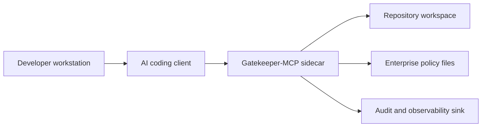

# Production Deployment Blueprint

Gatekeeper-MCP currently runs as a local stdio MCP server. This document describes production-facing deployment directions for enterprise teams evaluating AI coding governance.

## Sidecar model



## Recommended controls

- Run Gatekeeper with a dedicated workspace root.
- Mount the target repository read-only where possible.
- Keep MCP stdio transport isolated from application logs.
- Send diagnostics to stderr or a structured logging sink.
- Use organisation-controlled policy files in `.github/SECURITY.md` and `.github/ARCHITECTURE.md`.
- Add CI enforcement once the local developer workflow is stable.

## Docker Compose sketch

```yaml
services:
  gatekeeper-mcp:
    build: .
    environment:
      GATEKEEPER_WORKSPACE: /workspace
    volumes:
      - ./example-repo:/workspace:ro
    command: ["node", "dist/index.js"]
```

## Future deployment options

- GitHub Action for pull request policy checks.
- Remote MCP proxy mode for centralised governance.
- OpenTelemetry export to enterprise tracing platforms.
- OPA/Rego and AWS Cedar adapters.
- Container hardening profiles for Linux execution environments.
